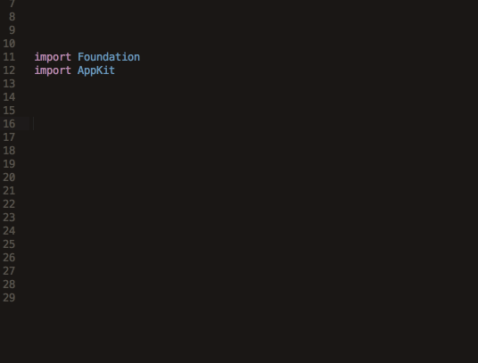
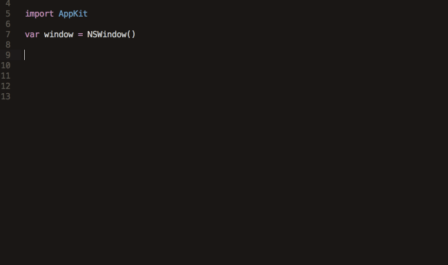

## SwiftKitten

SwiftKitten is a Swift autocompleter for Sublime Text, via the adorable 
[SourceKitten](https://github.com/jpsim/SourceKitten.git) framework.
Faster than XCode !





This package is new and still in beta! I welcome any suggestions. If
you find a bug, please open an issue. If you want to contribute, feel
free to fork and submit a pull request.


### Installation

First, make sure to install [SourceKitten](https://github.com/jpsim/SourceKitten.git) !

SwiftKitten is available via Package Control.

To install manually, clone this repository into your packages directory:

`git clone https://github.com/johncsnyder/SwiftKitten.git`

In Sublime, run `Preferences: Browse Packages`  from the command palette 
to find your packages directory. 


### Dependencies

The dependencies are included with the SwiftKitten package.

#### ijson

SwiftKitten uses [ijson](https://pypi.python.org/pypi/ijson) to parse
completions results from SourceKitten. By default, SwiftKitten will use
the pure python backend. If the faster `yajl2_cffi` backend is available,
SwiftKitten will automatically load it. It is highly recommended that
you build the cffi backend.


#### cffi [optional]

Navigate to `[Packages]/SwiftKitten/cffi/` and run `python setup.py build`.
This will build cffi in place. Maybe sure to run this command with `python3.3`.
Must be compatible with Sublime. Next time you start Sublime, SwiftKitten will
load the `yajl2_cffi` backend. 


### Caching

SwiftKitten uses [pygments](http://pygments.org) to parse autocomplete
prefixes and caches the result for the next time you request it. There will
be a slight delay the first time you autocomplete a function, but the next
time, it will be instantaneous. For example


SwiftKitten will remember the autocomplete results for `foo` and cache them.
The next time you type `foo.`, SwiftKitten will return the cached results.
Also, an autocomplete request will be sent if the cached results have timed
out (See `cache_timeout` in package settings). If the results
have changed, SwiftKitten will update the autocomplete window. A default
cache timeout of one second ensures you will always be shown up-to-date results,
while preventing a barrage of unnecessary requests to SourceKitten.

To clear the cache manually, run `SwiftKitten: Clear Cache` from the command
palette (this clears the framework cache also).


### Frameworks

SwiftKitten parses your file to find imported frameworks automatically.
SwiftKitten requests and caches framework globals separately, since they
are only needed once and requesting them via SourceKitten can take a while
(e.g. 20-30 seconds for Foundation).  It is possible to exclude specific 
frameworks from autocompletion results (See `exclude_framework_globals` in 
package settings).

The framework cache is persistant between sessions. It is saved to
Sublime's cache folder on saving a view, and is loaded next time SwiftKitten
is loaded.


##### External frameworks

Please provide a list of paths to external frameworks in settings under
`extra_framework_paths`. These are passed to SourceKitten via compilerargs.


### Documentation [experimental]

Running `SwiftKitten: Display Documentation` from the command palette,
or by pressing `ctrl+alt+d` will search a docset (path specified in settings)
via _docsetutil_ and display the most relevant entry in an html popup.





### Settings

See `SwiftKitten.sublime-settings` for more settings and information.
Copy this file to `[Packages]/User` to customize the settings.


```js
/*
    SwiftKitten default settings.

    All settings can be overriden in a sublime project file.
*/
{
	/* 
		Path to SourceKitten binary.
		See `https://github.com/jpsim/SourceKitten`.
	*/
	"sourcekitten_binary" : "/usr/local/bin/sourcekitten",

	/*
		sdk to link with. SourceKitten will find the 
		default sdk (OS X) if left blank.
	*/
	"sdk" : "",

	/*
		Extra framework search paths.

		To enable autocompletion for external frameworks, 
		add the path to the directory containing the 
		framework here.
	*/
	"extra_framework_paths" : [],

	/*
		Extra compiler arguments to SourceKitten.
	*/
	"extra_compilerargs" : "",

	/*
		Exclude globals from specific frameworks in auto-
		completion results. For example, `import Foundation`
		adds a lot of bloat to autocomplete results, and can 
		slow down typing.
	*/
	"exclude_framework_globals" : ["Foundation"],

	/*
		Timeout for cached completion data (in seconds).
	*/
	"cache_timeout" : 1.0,
	
	/*
		Limit to number of concurrent completion requests.
	*/
	"concurrent_request_limit" : 4,

	/*
		Enable linting. This will query structure info via
		SourceKitten, and underline any parse errors. Move 
		the cursor to the error position to see the error 
		description in the status bar.
	*/
	"linting" : true,

	/*
        Supress Sublime Text regular completions.
    */
	"suppress_word_completions" : true,
	"suppress_explicit_completions" : true,

	/*
		Path to docset.

		Running `ctrl+alt+d` will search the docset for the
		current word or selection and display the docs in
		a popup.
	*/
	"docsetutil_binary" : "/usr/local/bin/docsetutil",
	"docset" : "/Applications/Xcode.app/Contents/Developer/Documentation/DocSets/com.apple.adc.documentation.OSX.docset"
}
```


Additionally, settings can be overridden in a sublime project file.

It is recommended to add the following to user or Swift syntax specific preferences:

```js
"auto_complete_triggers": [ {"selector": "source.swift", "characters": "."} ]
```


### Troubleshooting


If autocompletion is not working, pull up the Sublime python
console (``ctrl+` ``) and see if any error messages are reported.


### TO DO


- Add support for multi-file projects/modules (e.g. specified in
	a sublime project file).

- Parse Xcode project to get file list and embedded frameworks 
	(similiar to SourceKittenDaemon).

- Add Xcode build, run and debug commands. Build system is not
	flexible enough. Specify the xcode project in sublime project
	file. Or if xcode project in same folder as sublime project,
	use this one as default.

- Build cffi automatically on sublime package install ?
	I'm not sure if sublime's python interpreter has the
	necessary tools to build it. Tried briefly but could
	not get it to work.

- Add support for multiple docsets. Make documentation context
	aware. Add support for api links, so that documentation 
	can be navigated.


### License

SwiftKitten is MIT licensed.
